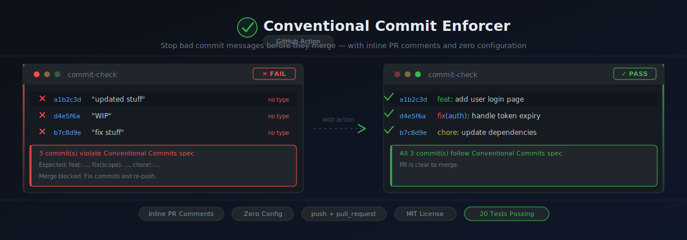

<p align="center">
  
</p>

# Conventional Commit Enforcer

> A GitHub Action that validates every commit in a pull request or push follows the [Conventional Commits](https://www.conventionalcommits.org/) specification.

[](https://github.com/Ardesh1r/conventional-commit-enforcer/actions/workflows/ci.yml)

---

## Why?

Consistent commit messages make changelogs, release notes, and semantic versioning automatic. This action enforces the format at the source — the pull request — before anything merges.

---

## Usage

Add this to your workflow file (`.github/workflows/commits.yml`):

```yaml
name: Conventional Commits

on:
  pull_request:
    types: [opened, synchronize, reopened]

jobs:
  check-commits:
    runs-on: ubuntu-latest
    steps:
      - uses: actions/checkout@v4
      - uses: Ardesh1r/conventional-commit-enforcer@v1
        with:
          token: ${{ secrets.GITHUB_TOKEN }}
```

---

## Commit Format

```
type(scope): description
```

| Part | Required | Example |
|------|----------|---------|
| `type` | ✅ | `feat`, `fix`, `chore` |
| `(scope)` | ❌ (configurable) | `(auth)`, `(api)` |
| `!` | ❌ | marks a breaking change |
| `description` | ✅ | short summary, not empty |

### Valid examples

```
feat: add user login
fix(auth): handle expired tokens
chore!: drop Node 16 support
docs(readme): update installation guide
ci: add matrix builds for Node 18 and 20
```

---

## Inputs

| Input | Default | Description |
|-------|---------|-------------|
| `token` | `${{ github.token }}` | GitHub token for reading PR commits and posting comments |
| `types` | `feat,fix,chore,docs,style,refactor,perf,test,build,ci,revert` | Comma-separated list of allowed commit types |
| `require-scope` | `false` | Set to `true` to make `(scope)` mandatory |
| `scope-pattern` | `[a-zA-Z0-9_.\-]+` | Regex pattern for valid scope names |
| `ignore-merge-commits` | `true` | Set to `false` to also validate merge commits |
| `post-comment` | `true` | Set to `false` to disable the failure comment on PRs |

## Outputs

| Output | Description |
|--------|-------------|
| `valid` | `"true"` if all commits passed, `"false"` otherwise |
| `failing-commits` | Newline-separated list of failing commit SHAs |

---

## Custom types

```yaml
- uses: Ardesh1r/conventional-commit-enforcer@v1
  with:
    types: 'feat,fix,chore,docs,ops,security'
```

## Require scope

```yaml
- uses: Ardesh1r/conventional-commit-enforcer@v1
  with:
    require-scope: 'true'
    scope-pattern: '[a-z]+'   # lowercase only
```

## Push events

The action also works on `push`:

```yaml
on:
  push:
    branches: [main, develop]
```

---

## On failure

When commits fail validation, the action:
1. Fails the workflow step with a clear message
2. Posts a summary table to the job summary page
3. Posts a comment on the PR listing every failing commit (configurable)

---

## License

MIT
